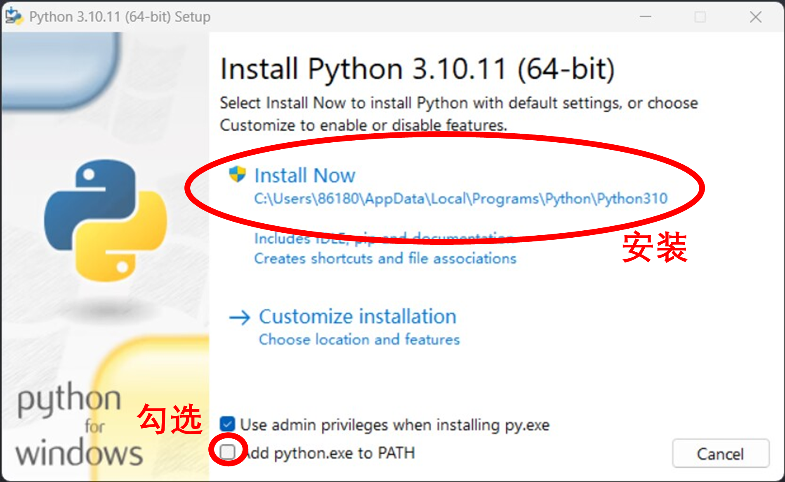

# PNG图层包自动导入脚本使用说明

1. 安装环境

   1. 安装雷电模拟器 9 并启动 （https://www.ldmnq.com/）
   2. 将画世界安装包拖入雷电模拟器 9 等待安装完成
   3. 安装 Python 3.10.11（https://www.python.org/ftp/python/3.10.11/python-3.10.11-amd64.exe），勾选带 PATH 的选项
      
   4. 启动 install.bat 安装环境，过程中保持联网
2. 打开模拟器

   1. 点击模拟器上面三条横线打开菜单-软件设置-性能设置
   2. 选择“手机版”，选择 540x960 （dpi 240），保存设置并重启模拟器
3. 模拟器右侧菜单-更多-共享文件-打开电脑文件夹

   1. 新建文件夹并命名为 "倒模"
   2. 在 "倒模" 文件夹里面随便放置一张图片，并命名为 "00.png"
   3. 模拟器右侧菜单-更多-共享文件-打开安卓文件夹
   4. 打开 "倒模" 文件夹，检查里面是否有名为 "00.png" 的图片
   5. 如果没有，重复 c d 两步
4. 打开 ”配置.txt”

   1. 第一行改为需要导出到画世界的琦趣梦导出的图层 zip 文件路径
   2. 模拟器右侧菜单-更多-共享文件-高级功能
   3. 复制“电脑共享路径” 右侧的输入框里的地址到 ”配置.txt” 的第二行
   4. 保存 ”配置.txt”并退出
5. 打开画世界

   1. 登录自己的账户
   2. 返回到画世界主界面
6. 双击启动 png2hsj.py，等待读条完成

   1. 如要终止，按住 F12
   2. 读条过程中请勿操作鼠标

## 注意事项

1. 使用前本脚本前请关闭电脑上的所有联网游戏，否则有封号危险

   * 原因：这个脚本使用的工具可能被游戏反外挂系统误检测为外挂
   * 尤其是腾讯游戏！尤其是腾讯游戏！尤其是腾讯游戏！
2. 导入的图层不包含混合模式信息，需要自行修改图层属性
3. 本工具依据 MIT 协议开源

   * 可随意使用、复制、修改、传播、分发
   * 可免费使用
   * 传播分发时需附上工具中的LICENSE 文件
